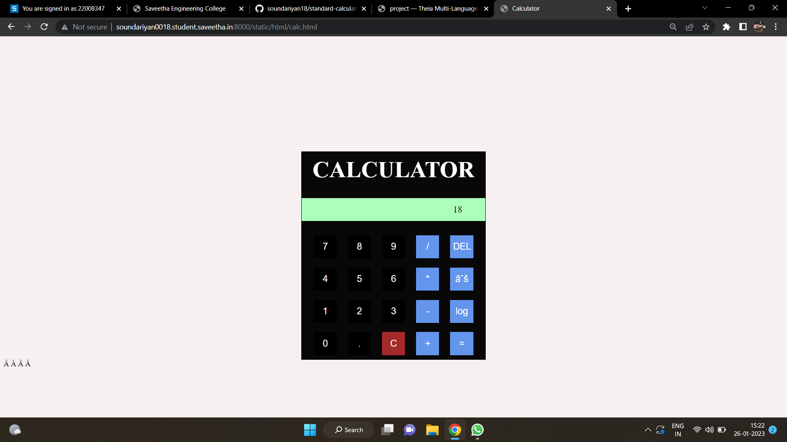
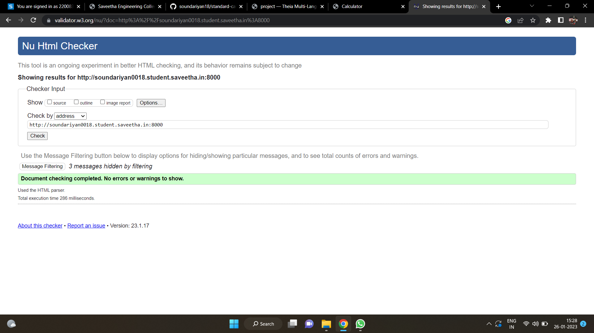

# Design of a Standard Calculator

## AIM:

To design a web application for a standard calculator.

## DESIGN STEPS:

### Step 1:
clone the github repository and create django admin interface


### Step 2:
change setting.py file to allow request from all hosts


### Step 3:
use css for creating attractive colors


### Step 4:
write javascript program for implementing five different operation


### Step 5:
validate the html and css code

### Step 6:
publish the website in the givenURL


## PROGRAM :
```
calc.html
<!DOCTYPE html>
<HTML lang="en">
    <head>
        <title>Calculator</title>
        
        <script>
        function calculate(args)
        {
            res = document.getElementById("result");
            expression = res.innerText;
            cmd = args.srcElement.innerText;
            if(cmd == "=")
            {
                expression = "" + eval(expression)
            }
            else if(cmd == "C")
            {
                expression=""
            }
            else if(cmd == "DEL")
            {
                expression = expression.slice(0, -1);

            }
            else if(cmd == "√")
            {
                expression = "" + Math.sqrt(eval(expression));
            }
            else if(cmd == "%")
            {
                expression = expression % 1;
            }
            else if(cmd == "log")
             {
        expression = Math.log10(expression);
           }
       
            else{
                expression = expression + cmd;
            }
            res.innerText = expression;
            

        }
         
        </script>

        <style>
          
            .calculator-container {
                width: 400px;
                background-color:rgb(8, 8, 8);
                margin: 0 auto; 
                margin-top: 250px;
                text-align: center;
                
            }

           
            button {
                width: 50px;
                height: 50px;
                margin: 10px; 
                font-size: 20px; 
                
                background-color: black; 
                color: white; 
                border: none;
            }

          
            #result {
                
       background-color:#ABFFBA;
    text-align: right;
    padding-right: 50px;
    font-size: 20px;
    margin-bottom: 20px; 
    border: solid black 0.5px;
    color: black;
    width: 348px;
    height: 50px;
    display: flex;
    align-items: center;
    justify-content: flex-end;

            }
            h1 {
                padding-top: 10px;
                color:white;
                font-size: 50px;
            }
            .redd {
                background-color: brown;
            }
            .bluee {
                
                background-color: cornflowerblue;
            }
            body {
                background-color: rgb(247, 240, 240);
            }
        </style>

    </head>
<body>
    <div class="calculator-container">
        <h1>CALCULATOR</h1>
        <div id="result">0</div>
        <button onclick="calculate(event);">7</button>
        <button onclick="calculate(event);">8</button>
        <button onclick="calculate(event);">9</button>
        <button class="bluee"  onclick="calculate(event);">/</button>
        <button class="bluee"  onclick="calculate(event);"> DEL </button><br>
        <button onclick="calculate(event);">4</button>
        <button onclick="calculate(event);">5</button>
        <button onclick="calculate(event);">6</button>
        <button class="bluee"  onclick="calculate(event);">*</button>
        <button class="bluee"  onclick="calculate(event);">√ </button><br>
        <button onclick="calculate(event);">1</button>
        <button onclick="calculate(event);">2</button>
        <button onclick="calculate(event);">3</button>
        <button class="bluee"  onclick="calculate(event);">-</button>
        <button class="bluee"  onclick="calculate(event);">log</button><br>
        <button onclick="calculate(event);">0</button>
        <button onclick="calculate(event);">.</button>
        <button class="redd" onclick="calculate(event);">C</button>
        <button class="bluee"  onclick="calculate(event);">+</button>
        <button class="bluee" onclick="calculate(event);">=</button><br>
    </div>
    </body>
    </HTML>
index.js
```

## OUTPUT:



## HTML VALIDATOR:



## Result:
The program for designing a simple calculator using javascript is excecuted successfully.
